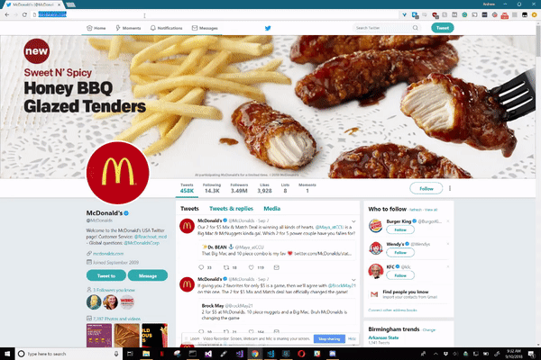

# McSurveys

## McSurveys is a Chrome extension that sets to McAutomate the process of receipt surveys, given a specific set of conditions that best fit mine and my coworkers' average visits. 

### These order conditions are:

* Ordering at the restaurant,
* Order is carried out to-go,
* Highly satisfied overall,
* * Clean restrooms = "N/A (did not visit)"
* * Clean exterior
* * Clean interior
* * Friendly crew
* * Food quality
* * Food taste
* * Service speed
* * Ease of ordering
* * Taste of french fries (??)
* No problem(s) experienced,
* Sandwich/wrap was NOT customized
* Main item ordered = "Other"
* Breakfast item ordered = "Other"
* Did NOT order from the $1|$2|$3 menu
* Did NOT use the McPick menu
* Rated this McDonald's better than the competitors
* Went in a party of 1
* Have gone 4+ times in past 30 days
* Highly likely to recommend in next 30 days
* Highly likely to return in next 30 days
* Picks at random between 1 and 6 restaurants (at random) from a list where you have eaten at in the past 30 days
* Your favorite restaurant of the selected and McDonald's is McDonald's

***

### Instructions: Enter your 26 digit survey key at the site linked on your receipt, then click `Next` and sit back for a few seconds until the survey is complete, at which point you will be provided with your code.

***

### To do:

- Implement jQuery to greatly simplify `content.js`
- Make error handling better
- Reduce timeout duration between pages